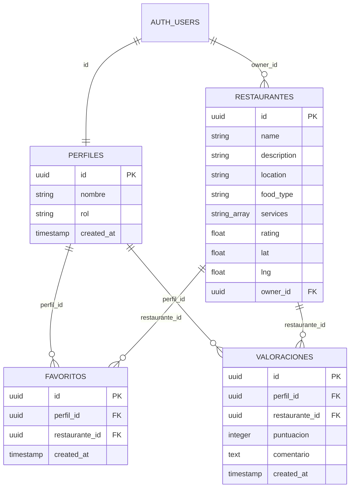
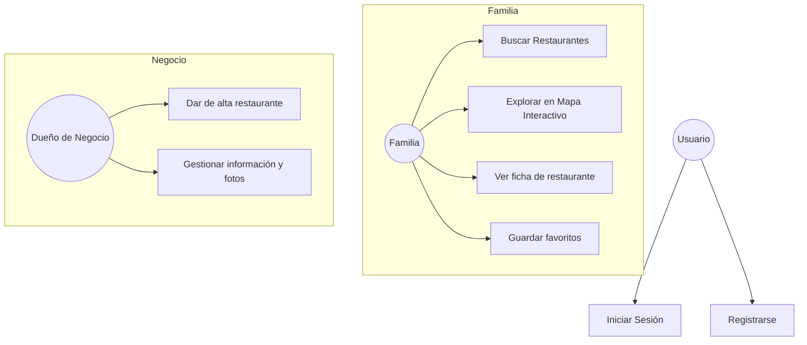

# 📝 Memoria del Trabajo de Fin de Grado: Play & Eat

**Autores:** [Tus Nombres]  
**Tutor:** [Nombre del Tutor]  
**Fecha:** Mayo 2026  

---

## APARTADO 1) RESUMEN

Este proyecto consiste en el desarrollo de una plataforma web denominada **Play & Eat**. Su objetivo principal es facilitar a las familias la búsqueda de restaurantes que cuenten con servicios específicos para niños, como zonas de juego, menús infantiles o animación, permitiendo así que tanto adultos como pequeños disfruten de su tiempo de ocio.

La aplicación resuelve el problema de la dispersión de información y la falta de filtros específicos en las plataformas gastronómicas actuales. A través de una interfaz intuitiva, los usuarios pueden encontrar locales adaptados a sus necesidades, mientras que los dueños de negocios disponen de una herramienta para promocionar sus instalaciones ante un público objetivo muy concreto. Los resultados esperados incluyen una mejora en la planificación familiar y un fomento del ocio compartido de calidad.

---

## APARTADO 2) JUSTIFICACIÓN DEL PROYECTO

La idea de este proyecto nace de una problemática real detectada en el día a día de las familias con niños pequeños. Existe una gran dispersión de información a la hora de organizar planes de ocio gastronómico. Aunque los creadores de contenido muestran sitios ideales en redes sociales, esa información termina perdida en guardados de Instagram o TikTok que resultan imposibles de localizar cuando realmente se necesitan.

El problema principal que se pretende resolver es la falta de un lugar centralizado para esos "planes de sobremesa". Las quedadas con amigos se vuelven complicadas porque, una vez terminada la comida, los niños entran en un estado de aburrimiento que obliga a las familias a recurrir a las pantallas para alargar la reunión.

**Play & Eat** surge para concentrar toda esa oferta dispersa en una sola herramienta, de forma que las familias tengan la seguridad de que, al elegir un sitio en la plataforma, los niños tendrán la oportunidad de jugar mientras los adultos disfrutan de la sobremesa, eliminando la dependencia de los dispositivos electrónicos.

### Análisis Comparativo con aplicaciones existentes

Se han analizado las plataformas de referencia del sector (**TripAdvisor** y **Yelp**) detectando las siguientes limitaciones frente a la propuesta de **Play & Eat**:

| Característica | TripAdvisor / Yelp | Play & Eat |
| :--- | :--- | :--- |
| **Filtro "Family Friendly"** | Genérico y subjetivo, basado en opiniones individuales. | Basado en servicios técnicos verificables por el negocio. |
| **Detalle de servicios infantiles** | No distingue entre tipos de entretenimiento. | Filtros específicos: Animación, Monitores, Zona de juegos. |
| **Público objetivo** | Turista generalista. | Familias locales con necesidades recurrentes. |
| **Concepto de "Sobremesa"** | No existe un enfoque en el tiempo del adulto. | Eje central del proyecto: ocio infantil para tranquilidad del adulto. |
| **Panel para negocios** | Gestión de ficha genérica. | Panel específico para publicar servicios y fotos orientados a familias. |

La principal mejora de **Play & Eat** respecto a las alternativas existentes radica en la **especialización**: mientras TripAdvisor y Yelp están diseñados para el viajero generalista, esta plataforma está construida desde cero para las necesidades concretas de las familias locales, convirtiendo la "búsqueda por azar" en una "búsqueda por necesidad técnica verificada".

---

## APARTADO 3) OBJETIVOS

### 3.1) OBJETIVO GENERAL
Desarrollar una plataforma integral (web y móvil-responsiva) que conecte a familias con restaurantes que ofrecen servicios de entretenimiento y cuidado infantil.

### 3.2) OBJETIVOS ESPECÍFICOS
*   Implementar un sistema de autenticación seguro diferenciando entre perfiles de familia y de negocio.
*   Crear una base de datos relacional y escalable para almacenar información detallada de los locales, incluyendo fotos y lista de servicios.
*   Desarrollar un buscador inteligente con filtros por categoría (Brunch, Comida, Merienda, Cena) y por servicios específicos de entretenimiento.
*   **Implementar un sistema de geolocalización interactivo** mediante mapas para facilitar la búsqueda visual de locales cercanos al usuario.
*   Diseñar un panel de administración intuitivo para que los dueños de los restaurantes puedan gestionar su información de forma autónoma.
*   **Implementar un sistema de edición de perfil** para que los usuarios puedan mantener actualizados sus datos personales.
*   **Desarrollar un sistema de favoritos** que permita a las familias guardar y gestionar de forma persistente sus restaurantes predilectos.
*   **Desarrollar un sistema de valoraciones (reseñas y estrellas)** para que las familias puedan puntuar y comentar su experiencia real en cada local, garantizando un feedback comunitario.
*   Asegurar que la web sea totalmente responsiva, permitiendo que se use cómodamente desde el móvil en cualquier lugar (filosofía Mobile First).

---

## APARTADO 4) DESARROLLO

### 4.1) FUNDAMENTACIÓN TEÓRICA

*   **Next.js (Framework Fullstack):** Framework basado en React que se ha utilizado para construir la aplicación completa. Gestiona tanto el renderizado de la interfaz como la lógica del servidor mediante **API Routes** propias. Una de sus características más relevantes es el soporte para **Server-Side Rendering (SSR)**, lo que permite que las páginas se generen en el servidor antes de enviarse al navegador, mejorando significativamente el rendimiento y la indexación en buscadores (SEO). *Justificación de su elección:* a diferencia de un proyecto React puro, Next.js permite centralizar frontend y backend en un único proyecto, reduciendo la complejidad y el tiempo de desarrollo.

*   **Leaflet & React-Leaflet:** Librería de código abierto para mapas interactivos. Se utiliza junto a **OpenStreetMap** como proveedor de cartografía. *Justificación:* permite ofrecer una experiencia de geolocalización profesional y gratuita, evitando los costes de licencias de APIs propietarias y garantizando la privacidad de los datos.

*   **TypeScript:** Superset de JavaScript que añade tipado estático al código. Sus características principales son la detección de errores en tiempo de compilación (antes de ejecutar el programa) y el autocompletado en el editor. *Justificación:* se ha elegido frente a JavaScript puro porque en un proyecto con múltiples modelos de datos (perfiles, restaurantes, favoritos) el tipado garantiza la coherencia de los datos en todo el flujo de la aplicación, reduciendo errores humanos críticos.

*   **Tailwind CSS:** Framework de estilos basado en clases de utilidad. En lugar de escribir hojas de estilo CSS separadas, los estilos se aplican directamente en el HTML/JSX mediante clases predefinidas. *Justificación:* su sistema de diseño por utilidades permite construir interfaces responsivas y consistentes de forma muy rápida, y el resultado final tiene un peso de CSS mínimo al eliminar automáticamente los estilos no utilizados.

*   **Supabase (Base de Datos):** Plataforma de base de datos como servicio (DBaaS) que proporciona una instancia de **PostgreSQL** en la nube con panel de administración visual. Sus características principales son la gestión de autenticación de usuarios, el almacenamiento de archivos y las políticas de seguridad a nivel de fila (Row Level Security - RLS). *Justificación:* se ha elegido como sistema de persistencia por su robustez, su integración nativa con sistemas de autenticación mediante JWT y la posibilidad de gestionar todos los datos desde un único panel sin necesidad de configurar un servidor propio.

### 4.2) MATERIALES Y MÉTODOS

#### Metodología de Trabajo: Desarrollo Ágil (Agile)

Se ha aplicado una **Metodología Ágil** basada en ciclos iterativos cortos denominados **Sprints** (de dos semanas de duración). La metodología ágil se caracteriza por los siguientes principios:

- **Entrega incremental:** el software se construye y se entrega por bloques funcionales completos, no todo de una vez al final.
- **Adaptabilidad:** permite cambiar los requisitos durante el desarrollo sin que ello suponga un bloqueo para el proyecto.
- **Revisión continua:** al final de cada Sprint se evalúa el resultado y se replanifica el siguiente ciclo.
- **Colaboración:** la comunicación constante entre los miembros del equipo es fundamental.

Esta metodología se eligió frente al modelo en **cascada** (Waterfall) porque, al tratarse de un proyecto con requisitos que podían evolucionar durante el desarrollo (como la incorporación del sistema de favoritos), la flexibilidad ágil resultaba más adecuada que un modelo secuencial rígido donde cada fase debe completarse antes de iniciar la siguiente.

#### Planificación del Proyecto

El desarrollo se ha estructurado en un cronograma de 12 semanas con una carga estimada de aproximadamente 300 horas totales:

| Fase | Descripción | Semanas | Horas Est. |
| :--- | :--- | :--- | :--- |
| **I. Análisis y Diseño** | Definición de requisitos, casos de uso y prototipado de la interfaz. | 1-2 | 40h |
| **II. Infraestructura** | Configuración de Next.js, Supabase y estructura de carpetas del proyecto. | 3 | 20h |
| **III. Backend** | Desarrollo de la API REST, controladores (`authController`, `restaurantController`, `valoracionController`), servicios (`authService`, `favoriteService`, `valoracionService`) y políticas de seguridad RLS. | 4-6 | 80h |
| **IV. Frontend** | Construcción de componentes (`RestaurantCard`, `Header`, `HeroBanner`, `RestaurantReviews`), páginas de usuario y panel de negocio, e integración con la API. | 7-9 | 90h |
| **V. Pruebas y QA** | Pruebas funcionales de flujos de usuario (registro, login, subida de restaurantes, favoritos, opiniones), corrección de errores y optimización de rendimiento. | 10-11 | 40h |
| **VI. Documentación** | Redacción de la memoria, guía técnica y vídeo demostrativo. | 12 | 30h |

*   **Diagrama de la base de datos:**

*   **Diagramas de casos de uso:**

*   **Estructura del proyecto:**

    El proyecto sigue una estructura de carpetas organizada por responsabilidades, lo que facilita el mantenimiento y la escalabilidad:

    *   **`/app`**: Contiene todas las rutas y páginas de la aplicación, gestionadas por el sistema de enrutamiento *App Router* de Next.js. Dentro de esta carpeta se distinguen dos tipos de contenido: las páginas visibles para el usuario (ej. `/mapa`, `/restaurantes`, `/perfil`, `/admin`) y los puntos de entrada de la API REST (carpeta `/app/api/`), que actúan como el backend del sistema.
    *   **`/components`**: Almacena piezas de interfaz reutilizables e independientes, como `RestaurantCard.tsx`, `Header.tsx`, `HeroBanner.tsx` o los componentes de cartografía `RestaurantsMap.tsx` y su envoltorio dinámico `MapWrapper.tsx`. Este patrón evita la duplicidad de código y garantiza que cualquier cambio visual se aplique de forma consistente en toda la aplicación.
    *   **`/lib`**: Contiene el núcleo lógico del backend, organizado en dos subcarpetas:
        *   `/lib/backend/controllers/`: Los **controladores** (ej. `authController.ts`, `restaurantController.ts`) reciben las peticiones de la API, validan los datos y delegan la operación al servicio correspondiente.
        *   `/lib/backend/services/`: Los **servicios** (ej. `authService.ts`, `favoriteService.ts`) son los únicos que interactúan directamente con la base de datos de Supabase, manteniendo la lógica de negocio separada del resto.
    *   **`/public`**: Almacena recursos estáticos como el logotipo e iconos de la aplicación.

#### 4.2.1) Breve análisis del código
La aplicación se basa en una arquitectura modular de tres capas (Componentes, Controladores y Servicios) que separa la interfaz de la lógica de negocio y el acceso a datos. Se ha implementado seguridad mediante roles y políticas **RLS** en Supabase, y se ha integrado un sistema de geolocalización dinámico mediante **Leaflet** con carga asíncrona para optimizar el rendimiento. Toda la información se gestiona en tiempo real mediante peticiones a una API REST propia desarrollada en Next.js.

### 4.3) RESULTADOS Y ANÁLISIS
Se ha logrado implementar una aplicación funcional que cumple con todos los requisitos iniciales. Las familias pueden registrarse y acceder a un listado dinámico de restaurantes, mientras que los dueños de negocios pueden publicar sus locales con éxito. El rendimiento del sistema es excelente gracias al uso de Next.js y la optimización de consultas a la base de datos.

---

## APARTADO 5) CONCLUSIONES
El desarrollo de **Play & Eat** ha permitido aplicar de forma práctica los conocimientos adquiridos durante el grado, enfrentando retos reales de la ingeniería de software como la gestión de sesiones, el diseño de APIs REST seguras y el desarrollo de interfaces responsivas. Se ha cumplido el objetivo de crear una herramienta útil que resuelve un problema real de las familias actuales.

---

## APARTADO 6) LÍNEAS DE INVESTIGACIÓN FUTURAS
Como ampliaciones identificadas para el futuro del proyecto, se proponen las siguientes líneas de desarrollo:
1.  **Sistema de Recomendaciones basado en IA:** Implementar algoritmos de aprendizaje automático para sugerir restaurantes de forma personalizada según la edad de los hijos y el historial de visitas de la familia.
2.  **Comunidad y Quedadas (Playdates):** Crear un espacio social donde las familias puedan contactar entre sí para organizar comidas grupales y fomentar la socialización de los niños.
3.  **Realidad Aumentada (Tour Virtual):** Integrar visualizaciones en 3D o realidad aumentada de las zonas de juego para que los padres puedan evaluar la seguridad de las instalaciones antes de realizar la reserva.
4.  **Sistema de valoraciones avanzadas:** Permitir que las familias publiquen comentarios y valoraciones específicas sobre la seguridad y limpieza de los servicios infantiles.
5.  **Sistema de Reservas Integrado:** Permitir reservar mesa directamente desde la plataforma, indicando el número de niños y adultos para pre-configurar tronas o espacios.

---

## APARTADO 7) BIBLIOGRAFÍA Y WEBGRAFÍA

*   Next.js. (2024). *Next.js Documentation*. Recuperado de [https://nextjs.org/docs](https://nextjs.org/docs)
*   Supabase. (2024). *Supabase Documentation*. Recuperado de [https://supabase.com/docs](https://supabase.com/docs)
*   Leaflet. (2024). *Leaflet - an open-source JavaScript library for interactive maps*. [https://leafletjs.com/](https://leafletjs.com/)
*   React-Leaflet. (2024). *React components for Leaflet maps*. [https://react-leaflet.js.org/](https://react-leaflet.js.org/)
*   Tailwind CSS. (2024). *Tailwind CSS Documentation*. Recuperado de [https://tailwindcss.com/docs](https://tailwindcss.com/docs)
*   MDN Web Docs. (2024). *JavaScript Guide*. Recuperado de [https://developer.mozilla.org](https://developer.mozilla.org)
*   Agile Alliance. (2024). *What is Agile?*. Recuperado de [https://www.agilealliance.org/agile101/](https://www.agilealliance.org/agile101/)
