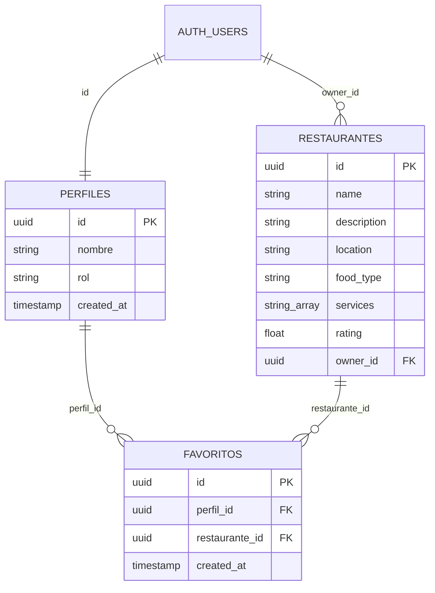
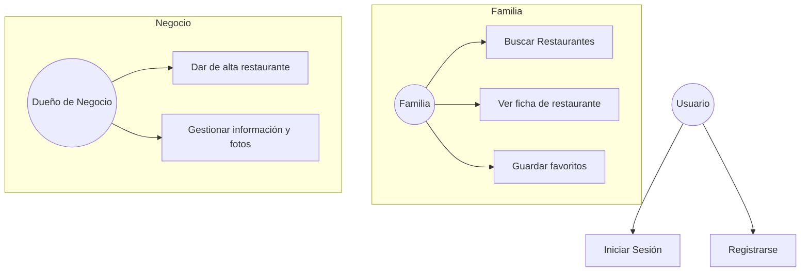

# 📝 Memoria del Trabajo de Fin de Grado: Play & Eat

**Autores:** [Tus Nombres]  
**Tutor:** [Nombre del Tutor]  
**Fecha:** Mayo 2026  

---

## APARTADO 1) RESUMEN

Este proyecto consiste en el desarrollo de una plataforma web denominada **Play & Eat**. Su objetivo principal es facilitar a las familias la búsqueda de restaurantes que cuenten con servicios específicos para niños, como zonas de juego, menús infantiles o animación, permitiendo así que tanto adultos como pequeños disfruten de su tiempo de ocio.

La aplicación resuelve el problema de la dispersión de información y la falta de filtros específicos en las plataformas gastronómicas actuales. A través de una interfaz intuitiva, los usuarios pueden encontrar locales adaptados a sus necesidades, mientras que los dueños de negocios disponen de una herramienta para promocionar sus instalaciones ante un público objetivo muy concreto. Los resultados esperados incluyen una mejora en la planificación familiar y un fomento del ocio compartido de calidad.

---

## APARTADO 2) JUSTIFICACIÓN DEL PROYECTO

La idea de este proyecto nace directamente de nuestra experiencia personal como familias con niños pequeños. En el día a día, nos encontramos con una gran dispersión de información a la hora de organizar planes. Aunque hoy en día hay muchísimos creadores de contenido que muestran sitios ideales en redes sociales, al final esa información se queda perdida en guardados de Instagram o Reels de TikTok que terminan olvidándose o siendo imposibles de localizar cuando realmente los necesitas.

El problema principal que queremos atacar es la falta de un lugar centralizado para esos "planes de sobremesa". Como padres y madres, vemos que muchas veces las quedadas con amigos se vuelven complicadas porque, una vez terminada la comida, los niños entran en un estado de aburrimiento que obliga a las familias a recurrir a las pantallas (móviles o tablets) para poder alargar un poco la reunión. 

**Play & Eat** surge para concentrar toda esa oferta dispersa en una sola herramienta. Queremos que las familias tengan la seguridad de que, al elegir un sitio de nuestra plataforma, los niños tendrán la oportunidad de jugar y divertirse mientras los adultos disfrutan de la sobremesa, eliminando la dependencia de los dispositivos electrónicos y recuperando el valor de compartir tiempo de calidad en comunidad. 

Además, este proyecto nos permite aplicar y consolidar conocimientos técnicos en un problema real, uniendo la gestión de datos con una interfaz diseñada para facilitar la vida de las familias.

---

## APARTADO 3) OBJETIVOS

### 3.1) OBJETIVO GENERAL
Desarrollar una plataforma integral (web y móvil-responsiva) que conecte a familias con restaurantes que ofrecen servicios de entretenimiento y cuidado infantil.

### 3.2) OBJETIVOS ESPECÍFICOS
*   Implementar un sistema de autenticación seguro diferenciando entre perfiles de familia y de negocio.
*   Crear una base de datos relacional y escalable para almacenar información detallada de los locales, incluyendo fotos y lista de servicios.
*   Desarrollar un buscador inteligente con filtros por categoría (Brunch, Comida, Merienda, Cena) y por servicios específicos de entretenimiento.
*   Diseñar un panel de administración intuitivo para que los dueños de los restaurantes puedan gestionar su información de forma autónoma.
*   Asegurar que la web sea totalmente responsiva, permitiendo que se use cómodamente desde el móvil en cualquier lugar (filosofía Mobile First).

---

## APARTADO 4) DESARROLLO

### 4.1) FUNDAMENTACIÓN TEÓRICA

*   **Next.js (Frontend y Backend):** Framework de React que hemos utilizado para construir la aplicación completa. Gestiona toda la lógica de **Backend** mediante API Routes, actuando como el motor que procesa la información antes de enviarla a la base de datos.
*   **TypeScript:** Utilizado para añadir tipado estático al código, reduciendo errores humanos y facilitando el mantenimiento a largo plazo.
*   **Tailwind CSS:** Framework de estilos que permite un desarrollo visual rápido y consistente mediante clases de utilidad.
*   **Supabase (Base de Datos):** Utilizado exclusivamente como nuestra base de datos relacional (PostgreSQL) en la nube. Es el sistema encargado de almacenar y proteger toda la información de los restaurantes y perfiles.

### 4.2) MATERIALES Y MÉTODOS

*   **Metodología de trabajo:** Hemos aplicado una **Metodología Ágil e Iterativa**. En lugar de intentar construir todo de golpe, hemos ido desarrollando la aplicación por bloques funcionales (Sprints). Esto nos ha permitido probar cada parte de forma independiente y corregir fallos antes de pasar a la siguiente fase.

*   **Planificación del proyecto:**
    1.  Análisis y Diseño (Semanas 1-2): Definición de la idea y prototipado.
    2.  Infraestructura (Semana 3): Configuración de Next.js y base de datos en Supabase.
    3.  Backend (Semanas 4-6): Desarrollo de controladores, servicios y autenticación.
    4.  Frontend (Semanas 7-9): Construcción de componentes e integración con la API.
    5.  Pruebas y QA (Semanas 10-11): Testeo de errores y optimización.
    6.  Documentación (Semana 12): Redacción final de la memoria y vídeo.

*   **Diagrama de la base de datos:**

*   **Diagramas de casos de uso:**

*   **Estructura del proyecto:**
    *   **`/app`**: Contiene las rutas y páginas de la aplicación. Aquí se encuentra tanto la lógica visual como los puntos de entrada de la API.
    *   **`/components`**: Piezas de interfaz reutilizables (botones, tarjetas, navegadores) para evitar duplicidad de código.
    *   **`/lib`**: Contiene el "cerebro" de la aplicación (Controllers y Services).
    *   **`/public`**: Almacena recursos estáticos como logos e iconos.

#### **Diagramas de casos de uso**
Representación de las interacciones principales de los usuarios con el sistema:

#### **Breve análisis del código**
El corazón del sistema reside en el patrón **Controller-Service**. El `authService.ts` gestiona la creación de perfiles y sesiones en Supabase, mientras que el componente `FeaturedRestaurants.tsx` realiza consultas asíncronas para mostrar los datos en tiempo real de la base de datos, eliminando la necesidad de datos estáticos en el código.

### 4.3) RESULTADOS Y ANÁLISIS
Se ha logrado implementar una aplicación funcional que cumple con todos los requisitos iniciales. Las familias pueden registrarse y acceder a un listado dinámico de restaurantes, mientras que los dueños de negocios pueden publicar sus locales con éxito. El rendimiento del sistema es excelente gracias al uso de Next.js.

---

## APARTADO 5) CONCLUSIONES
El desarrollo de **Play & Eat** nos ha permitido aplicar de forma práctica los conocimientos adquiridos durante el grado, enfrentándonos a retos reales como la gestión de sesiones de usuario y el diseño responsivo. Hemos cumplido el objetivo de crear una herramienta útil que ataca un problema real de las familias actuales.

---

## APARTADO 6) LÍNEAS DE INVESTIGACIÓN FUTURAS
Como ampliaciones para el futuro, hemos identificado las siguientes mejoras:
1.  **Sistema de Recomendaciones basado en IA:** Implementar algoritmos de aprendizaje automático para sugerir restaurantes de forma personalizada según la edad de los hijos y el historial de visitas de la familia.
2.  **Comunidad y Quedadas (Playdates):** Crear un espacio social donde las familias puedan contactar entre sí para organizar comidas grupales y fomentar la socialización de los niños.
3.  **Realidad Aumentada (Tour Virtual):** Integrar visualizaciones en 3D o realidad aumentada de las zonas de juego para que los padres puedan evaluar la seguridad y el tipo de instalaciones antes de realizar la reserva.
1.  **Sistema de valoraciones:** Permitir que las familias dejen comentarios y notas.
2.  **Integración de Mapas:** Mostrar los restaurantes en un mapa interactivo.
3.  **Sistema de Reservas:** Permitir reservar mesa directamente.

---

## APARTADO 7) BIBLIOGRAFÍA Y WEBGRAFÍA
*   Next.js. (2024). *Next.js Documentation*. Recuperado de [https://nextjs.org/docs](https://nextjs.org/docs)
*   Supabase. (2024). *Supabase Documentation*. Recuperado de [https://supabase.com/docs](https://supabase.com/docs)
*   Tailwind CSS. (2024). *Tailwind CSS Documentation*. Recuperado de [https://tailwindcss.com/docs](https://tailwindcss.com/docs)

*   **Breve análisis del código:**
    El corazón del sistema reside en el patrón **Controller-Service**. El `authService.ts` gestiona la creación de perfiles y sesiones en Supabase, mientras que el componente `FeaturedRestaurants.tsx` realiza consultas asíncronas para mostrar los datos en tiempo real de la base de datos, eliminando la necesidad de datos estáticos en el código.

### 4.3) RESULTADOS Y ANÁLISIS

Se ha logrado implementar una aplicación funcional que cumple con todos los requisitos iniciales. Las familias pueden registrarse y acceder a un listado dinámico de restaurantes, mientras que los dueños de negocios pueden publicar sus locales con éxito. El rendimiento del sistema es excelente gracias al uso de Next.js, y la integración con Supabase ha demostrado ser una solución robusta para la gestión de datos y usuarios.

---

## APARTADO 5) CONCLUSIONES

El desarrollo de **Play & Eat** nos ha permitido aplicar de forma práctica los conocimientos adquiridos durante el grado, enfrentándonos a retos reales de la ingeniería de software como la gestión de sesiones de usuario y el diseño responsivo. Hemos cumplido el objetivo de crear una herramienta útil que ataca un problema real de las familias actuales. Como aprendizaje principal, destacamos la importancia de una buena arquitectura inicial para facilitar los cambios posteriores.

---

## APARTADO 6) LÍNEAS DE INVESTIGACIÓN FUTURAS

Como ampliaciones para el futuro, hemos identificado las siguientes mejoras:
1.  **Sistema de valoraciones:** Permitir que las familias dejen comentarios y notas sobre los servicios infantiles.
2.  **Integración de Mapas:** Mostrar los restaurantes en un mapa interactivo basado en la ubicación del usuario.
3.  **Sistema de Reservas:** Permitir reservar mesa directamente desde la plataforma indicando el número de niños y adultos.

---

## APARTADO 7) BIBLIOGRAFÍA Y WEBGRAFÍA

*   Next.js. (2024). *Next.js Documentation*. Recuperado de [https://nextjs.org/docs](https://nextjs.org/docs)
*   Supabase. (2024). *Supabase Documentation*. Recuperado de [https://supabase.com/docs](https://supabase.com/docs)
*   Tailwind CSS. (2024). *Tailwind CSS Documentation*. Recuperado de [https://tailwindcss.com/docs](https://tailwindcss.com/docs)
*   MDN Web Docs. (2024). *JavaScript Guide*. Recuperado de [https://developer.mozilla.org](https://developer.mozilla.org)
